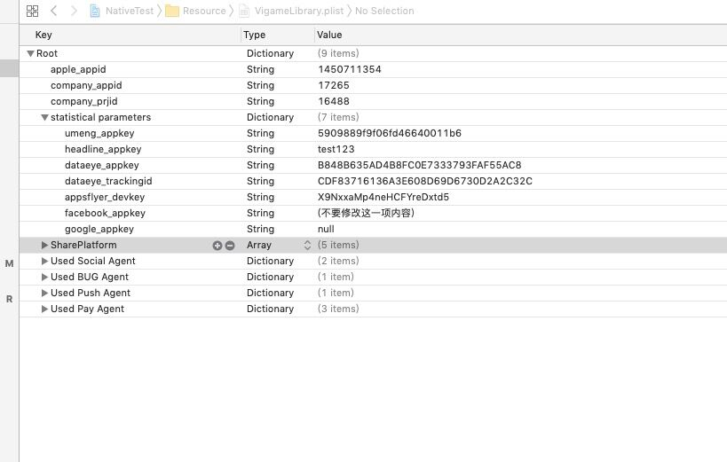

# IOS接入

## 1.将Vigame文件拷贝到工程文件目录，添加到工程中!

## 2.删除include文件下的deps 文件夹的引用!


## 3.添加所有xx.framework xx.a 头文件搜索路径

target-&gt;build setting -&gt; search path -&gt;Header Search Paths 中添加头文件路径

```text
``` "$(SRCROOT)/Vigame/include"
```

```text
``` "$(SRCROOT)/Vigame/include/deps/boost/include"
```

```text
``` "$(SRCROOT)/Vigame/include/deps/openssl/include/ios"
```


## 4.添加系统支持库文件 target-&gt;build phases -&gt;Link Binary with Libraries

```text
```OpenGLES.framwork
```

```text
```iAd.framwork
```

```text
```AVFoundation.framwork
```

```text
```MobileCoreServices.framwork
```

```text
```CoreLocation.framwork
```

```text
```QuartzCore.framwork
```

```text
```AdSupport.framwork
```

```text
```CoreFoundation.framwork
```

```text
```CoreMedia.framwork
```

```text
```CoreText.framwork
```

```text
```MediaPlayer.framwork
```

```text
```libresolv.9.tbd
```

```text
```MessageUI.framwork
```

```text
```AudioToolBox.framwork
```

```text
```libz.tbd
```

```text
```libiconv.tbd
```

```text
```libc++.tbd
```

```text
```libresolv.tbd
```

## 5.设备编译选项

```text
target->build setting ->Other Linker Flags      添加```-ObjC
target->build setting ->Enable Bitcode 设置为NO
target->build setting ->C language Dialect 设置为 gnu11
target->build setting ->C++ language Dialect 设置为 GNU++14[-std=gnu++14]
target->build setting ->C++ language Enable C++ Runtime Times 设置为YES
target->build setting ->Objective-C Automatic Reference Counting 设置为YES
```


## 6. SDK初始化工作

在工程的入口appDelegate.m文件中 应用头文件 `#import "IOSLoader.h"`

（unity 项目的项目入口文件 为 UnityAppController.mm

cocos creator 项目的项目入口文件为 AppController.mm ）

调用SDK 初始化方法

```text
- (BOOL)application:(UIApplication *)application didFinishLaunchingWithOptions:(NSDictionary *)launchOptions {

​    [IOSLoader startLoaderLibrary];

​    //your code here
​    
​    //打开开屏广告
​    [IOSLoader openSplash];​ 
​    return YES;   
}
```

```text
- (void)applicationDidEnterBackground:(UIApplication *)application {

    [IOSLoader is_Active:false];
}
```

```text
- (void)applicationDidBecomeActive:(UIApplication *)application {
    [IOSLoader is_Active:true];
}
```

## 7. 调用广告

引用广告头文件`#include "vigame_ad.h"`

```text
 // 打开一个横幅广告
 vigame::ad::ADManager::openAd("banner");
```

```text
// 打开关闭横幅广告
vigame::ad::ADManager::closeAd("banner");
```

```text
// 打开一个插屏广告 参数为广告位名称
vigame::ad::ADManager::openAd("pause");
```

```text
 // 打开一个开屏广告
 vigame::ad::ADManager::openAd("splash");
```

```text
 /*监听 某个视频广告位是否加载成功*/
 //方式1  参数为广告位名称
 vigame::ad::ADManager::addAdReadyChangedCallback("level_fail_mfzs", [=]    (bool isReady){
        if (isReady) {
            NSLog(@"level_fail_mfzs视频广告位 加载成功");
        }
  });
//方式2
vigame::ad::ADManager::isAdReady("level_fail_mfzs");
```

```text
// 打开一个视频广告 && 监听是否视频播放成功  参数为打开广告位名称
  vigame::ad::ADManager::openAd("level_fail_mfzs",[=](vigame::ad::ADSourceItem* adSourceItem, int result){
      if (1 == result) {/*打开视频失败*/ }
      else if( 0 == result){/*打开视频成功*/ }
   });
```

```text
// 在 appDelegate.mm 文件中  打开一个 唤醒游戏广告
- (void)applicationDidBecomeActive:(UIApplication *)application {
    //打开一个唤醒广告
    [IOSLoader openGame_awaken];
}
```

```text
// 在 appDelegate.mm 文件中  打开一个 开屏广告
- (BOOL)application:(UIApplication *)application didFinishLaunchingWithOptions:(NSDictionary *)launchOptions {
    [IOSLoader openSplash];
}
```

## 8.参数填写

`apple_appid` 苹果id 在苹果商店 注册应用产生的参数 `company_appid` 公司appid

`company_prjid` 公司的项目id

`statistical parameters` 中包换各种统计需要的参数 如果需要使用到 对应的统计平台 填写对应的参数 如果不需要使用对应的平台 对应的value选项填null 或者空着



